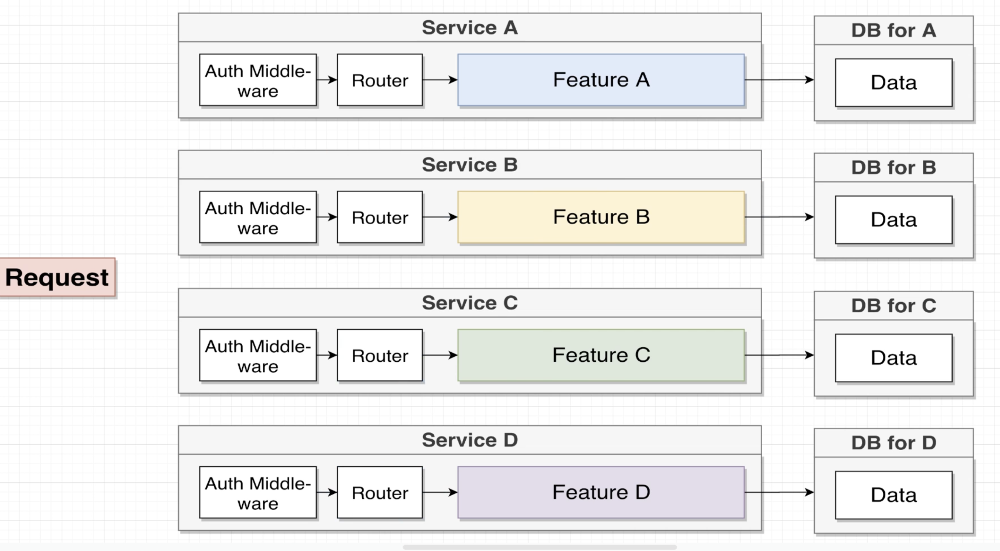
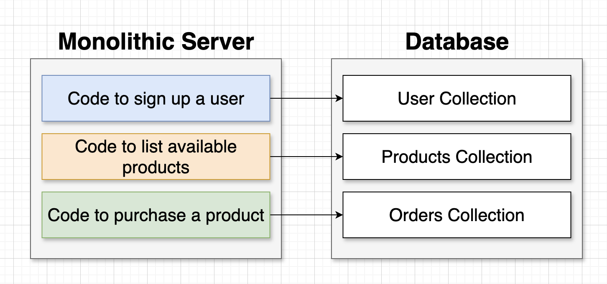
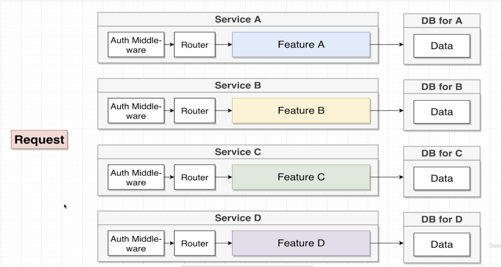
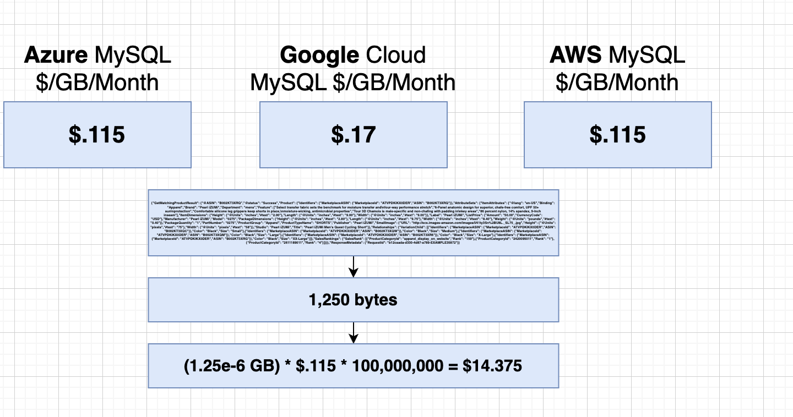

# Asynchronous Communication Between Services: Method 2

## Overview

This video focuses on the second method of asynchronous communication between services, particularly within an e-commerce application that includes Service DX. Unlike synchronous communication, which relies on direct service-to-service calls, this asynchronous approach uses an **event bus** to communicate events between services, making the system more resilient and decoupled.

### Goal of Service DX

The exact goal of Service DX is to show the **title and image** for every product that a particular user has ordered. Given a user ID, Service DX should return all the products they have ever ordered.

---

## Step-by-Step Process

### 1. Defining the Database Structure for Service DX

For Service DX to function correctly, it needs access to user and product data. The service maintains two collections:

- **Users Collection:** Stores user IDs and product IDs corresponding to products the user has ordered.
- **Products Collection:** Stores product IDs along with their titles and images.

Example data:

- **User Collection:**
  - User ID: 1, Ordered Products: [5, 20]
- **Products Collection:**
  - Product ID: 5, Title: "Pants", Image: "pants.jpeg"
  - Product ID: 20, Title: "Shoes", Image: "shoes.jpeg"

### 2. Problem: Getting Data Into Service DX

The challenge arises because Service DX is not informed when a user signs up, when products are created, or when a product is ordered by a user. These events occur in other services, such as Service A, B, and C, but Service DX needs to know about them to update its database.

### 3. Solution: Using Asynchronous Communication

To solve this, we use **asynchronous event communication**. Services A, B, and C emit events to an event bus whenever something interesting happens (e.g., a new product is created, a user signs up, or an order is made). Service DX listens to these events and updates its own database accordingly.

### 4. Workflow

- **Creating a Product (Service B):**  
  When a new product is created, Service B emits an event, which is sent to the event bus. The event contains details like the product ID, title, and image. Service DX listens to this event and updates its product database with the new product.

- **User Signs Up (Service A):**  
  When a new user signs up, Service A emits a `user created` event containing the user ID. Service DX listens to this event and adds the user to its users collection.

- **Ordering a Product (Service C):**  
  When a user places an order, Service C emits an `order created` event, which contains the user ID and the product ID. Service DX listens to this event and updates the user's ordered products.

### 5. Database Update in Service DX

For each event, Service DX updates its database:

- After receiving the product creation event, Service DX adds the new product to its product collection.
- After receiving the user creation event, Service DX creates a new user record with an empty array of ordered products.
- After receiving the order creation event, Service DX updates the user's record with the ordered product IDs.

### 6. Final Result

Once all events are processed, Service DX can quickly and independently answer queries like: "What products has a user with ID 1 ordered?"

---

## Pros and Cons of Asynchronous Communication

### Pros:

- **Decoupling of Services:** Services do not need to wait for each other to complete actions, making them more independent.
- **Scalability:** Events can be processed at different times, allowing the system to scale more effectively.
- **Resilience:** Since the services are not directly dependent on each other, the failure of one service does not block others.

### Cons:

- **Complexity:** Managing the flow of events and ensuring consistency across services can become complex.
- **Event Handling Failures:** If an event fails to be processed, the state may not be updated correctly, requiring retries or additional error-handling logic.
- **Latency:** The system’s responsiveness depends on the slowest event being processed, as events are handled asynchronously.
- **Event Tracking:** Managing and debugging events can be more challenging than synchronous communication.

---

## Summary

This second method of asynchronous communication leverages an event bus for services to communicate in a decoupled and resilient way. Events emitted by services (such as product creation, user sign-up, and order creation) are processed by Service DX to keep its internal database up-to-date. This method allows for more scalable, independent, and fault-tolerant systems, although it adds complexity to the overall architecture.

In the next video, we will look at a summary of the pros and cons, and compare this approach with synchronous communication.
