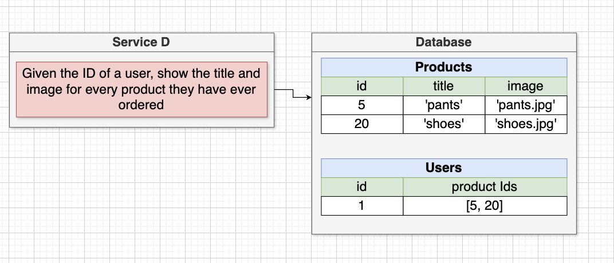
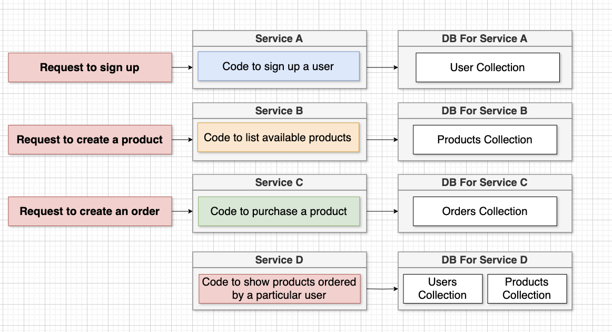

# Lesson 3: Data Management in Microservices Architecture

## Introduction

In this session, we discussed the practical challenges associated with data management in a microservices architecture, specifically focusing on the difficulties encountered when implementing a new feature that requires accessing data across multiple services. We illustrated these challenges using a simple e-commerce application example.

## E-commerce Application Example

### Application Features

- **Sign Up**: Allows users to sign up.
- **List Products**: Displays available products (e.g., hats, pants, shoes).
- **Purchase Products**: Enables users to purchase products.

### Monolithic Approach

In a monolithic architecture, all application features and data are housed in a single codebase and database.

#### Structure

- **Monolithic Server**: Contains code for user sign-up, listing products, and purchasing products.
- **Database**: Contains tables/collections for users, products, and orders.

#### Example Feature Addition

To implement a feature that shows all products ordered by a specific user:

1. **Query Users Table**: Verify user existence.
2. **Query Orders Table**: Retrieve user's orders.
3. **Query Products Table**: Fetch product details for the ordered items.

In a monolithic architecture, querying multiple tables/collections within the same database is straightforward.

### Transition to Microservices

In a microservices architecture, the application is decomposed into smaller, independent services, each with its own database.

#### Structure

- **Service A (User Service)**: Manages user sign-up with its own database for user data.
- **Service B (Product Service)**: Manages listing products with its own database for product data.
- **Service C (Order Service)**: Manages product purchases with its own database for order data.

#### Data Management Challenge

Adding a new service, **Service DX**, to show products ordered by a specific user presents a challenge:

- **Service DX** needs data from the User, Product, and Order services.
- **Microservices Constraint**: Services cannot directly access each other's databases.

#### Problem

To implement **Service DX**, it must:

1. Verify the user's existence.
2. Retrieve the user's orders.
3. Fetch product details for the ordered items.

However, since direct database access across services is not allowed, **Service DX** cannot query the databases of User, Product, and Order services directly. This restriction creates a significant challenge in accessing the necessary data to implement the feature.

### Core Issue

The core issue in microservices architecture is managing data across services without violating the principle of database encapsulation. Services must find a way to communicate and share data without direct database access, leading to complex data management scenarios.

## Upcoming Solution Discussion

In the next session, we will explore two general methodologies to overcome the data management challenge and enable **Service DX** to function effectively without violating the microservices principle of database isolation.

By understanding these methodologies, we can design robust microservices architectures that maintain service independence while still facilitating necessary data interactions across services.

