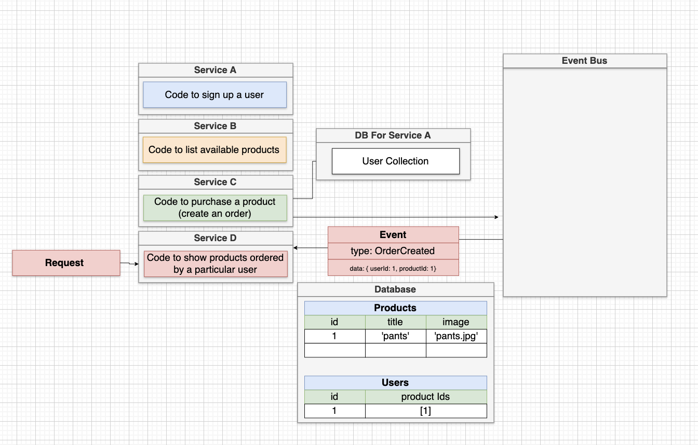

# Microservices Introduction

## Overview

This document provides a comprehensive introduction to the concept of microservices, contrasting it with the traditional monolithic architecture. It explains the fundamental differences and benefits of using a microservices approach.

## Monolithic Architecture

### Definition

A **Monolithic Architecture** is a traditional way of building servers where all the code necessary for the application is housed in a single codebase and deployed as one unit.

### Request Flow

1. **Requests**: Originates from users' browsers or mobile devices.
2. **Pre-processing Middleware**: The request flows into the application, possibly through some pre-processing middleware.
3. **Routing**: Routed to the appropriate feature for processing.
4. **Database Interaction**: The feature might interact with a database to read/write data.
5. **Response**: A response is formulated and sent back to the requester.

### Characteristics

- Contains all routing, middleware, business logic, and database access code required for all features of the application.

## Transition to Microservices Architecture

### Definition

A **Microservices Architecture** is an architectural style where the application is divided into multiple smaller, self-contained services, each responsible for a specific feature of the application.

### Key Concept

Each microservice has all the code needed to implement one feature, including routing, middleware, business logic, and database access.

## Visual Comparison

### Monolithic vs. Microservices

- **Monolithic Architecture**: The application’s entire codebase is centralized and interconnected.
- **Microservices Architecture**: The application is decomposed into smaller services, each encapsulating a specific feature.

## Detailed Explanation of Microservices

### Self-contained Services

Each microservice operates independently with its own middleware, router, and even its own database. This independence ensures that if one service fails, the others continue to function, maintaining partial application availability.

### Service Independence

Example: Service A has all necessary components (middleware, router, database) to function independently of other services. The architecture promotes resilience and modularity.

## Working Definition

A **Microservice** is defined as a service that contains all the code required to make one feature work correctly, including routing, middleware, business logic, and database access.

## Summary

- **Monolithic Architecture**: All features of the application are built into a single codebase.
- **Microservices Architecture**: Features are divided into self-contained services, each responsible for a specific part of the application.

By transitioning from a monolithic to a microservices architecture, applications can achieve greater modularity, resilience, and easier scalability. Each microservice operates independently, ensuring that the failure of one service does not impact the entire application.

